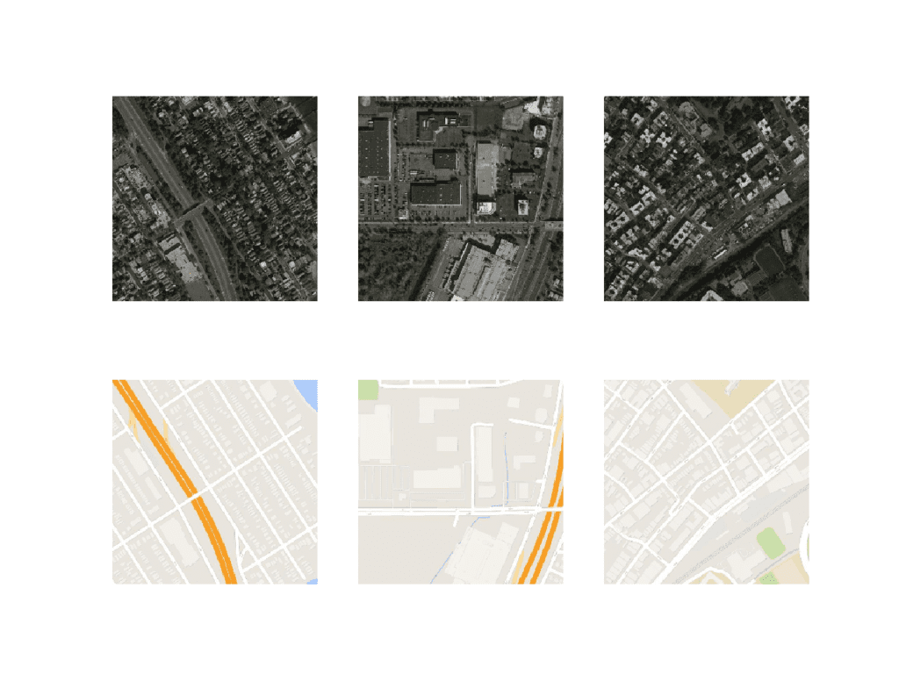
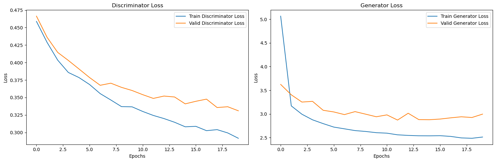

# GANs  



## Objectives

The objectives of this project is to develop a **quantum GAN** using parameterized quantum circuits in order to be able to compare both classical and quantum models and study *training stability*, *sample quality* or *convergence behavior*.

This project is part of a broader exploration of **Quantum Computing** and **Quantum Machine Learning**.

## Background
Generative Adversarial Networks consist of two competing models:

- **Generator (G)**: Generates synthetic data
- **Discriminator (D)**: Distinguishes real data from generated data

The objective function is describe as follows:

$$\min_{G} \max_{D} V(D, G) = \mathbb{E}_{x \sim p_{data}} [\log D(x)] + \mathbb{E}_{z \sim p_{z}} [\log(1 - D(G(z)))]$$

One objective of G is to minimize V, whereas another objective of G is to maximize V.

CycleGANs consist of two generators and two discriminators. The generators learn to translate images from domain `X` to domain `Y` and vice versa, while the discriminators aim to distinguish between real and generated images in both domains. We'll define the architecture for both the generator and the discriminator, using a standard architecture for CycleGAN.


## Structure

```text
.
├── data/
│   └── dataset.py
│
├── qgan/              
│   ├── generator.py
│   ├── discriminator.py
│   └── vqc.py
│
├── experiments/
├── main.ipynb
├── LICENSE
└── README.md
```

## Model performance


## Author
Project build by **Antony Manuel** and inspired by **Omar Ikne**'s courses, PhD student at IMT Nord Europe.